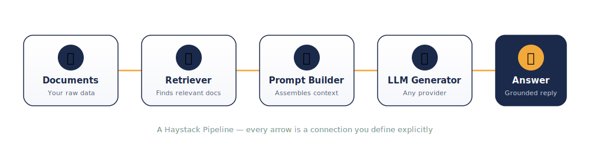
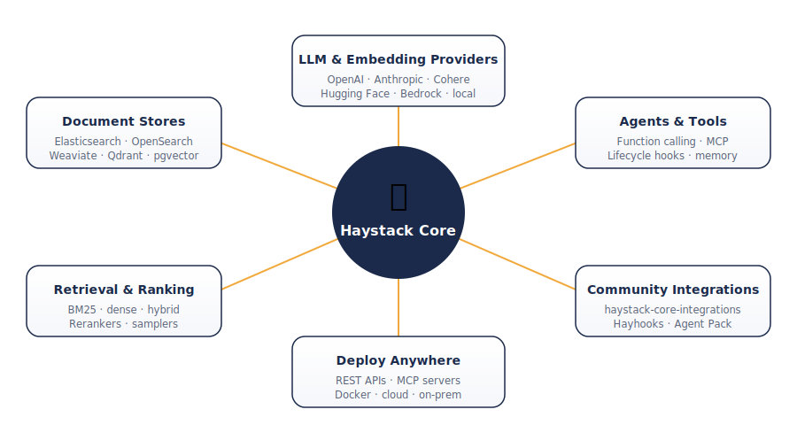

<div align="center">

</div>

<div align="center">

[](https://pypi.org/project/haystack-ai/)

[](LICENSE)
[](https://github.com/deepset-ai/haystack/actions/workflows/tests.yml)

</div>

<br>

## What this is

Haystack is a Python framework for wiring together the pieces an LLM application actually needs in production: something that goes and finds the right information, something that decides what to do with it, and something that turns it into a response — with every step visible and swappable, rather than buried inside a single black-box call.

Under the hood, everything is a **component** — a small, self-contained unit with typed inputs and outputs. You connect components into a **Pipeline** (a directed graph the framework validates and runs for you) or hand them to an **Agent** that decides at runtime which tools to call and when to stop. Nothing about the control flow is hidden from you; if you want to see exactly why a particular document was retrieved or why the model called a particular tool, you can, because the graph is explicit.

## Why people reach for it instead of gluing API calls together

**The wiring is visible.** A `Pipeline` is a graph you can inspect, draw, save to YAML, and reload. When something goes wrong three components deep, you're debugging a named node, not stepping through a wall of chained function calls.

**Agents are more than a system prompt and a while-loop.** Hooks fire at defined points in an agent's execution (`before_llm`, `before_tool`, `on_exit`, and others), so you can add guardrails, logging, or cost limits without forking the agent's internals. Token usage and tool-call counts are tracked automatically.

**It doesn't lock you into one model vendor.** The same pipeline code runs against OpenAI, Anthropic, Cohere, Mistral, Hugging Face models, Bedrock, Azure, or something running locally — swapping providers is a one-line change to a component's constructor, not a rewrite.

**Retrieval is a first-class citizen, not an afterthought.** The codebase ships dedicated retrievers for sparse, dense, multi-query, sentence-window, and auto-merging retrieval strategies, plus rankers and samplers to shape what actually reaches the prompt.

**Async and streaming aren't bolted on.** The same pipeline definition can run synchronously or asynchronously, and chat generators stream tokens as they arrive.

## How the pieces fit together

<div align="center">

</div>

That's the shape of a basic RAG pipeline. Swap the retriever for a hybrid one, add a ranker between retrieval and prompting, or replace the single LLM call with an `Agent` that can call tools and loop — the graph metaphor stays the same as the system grows more complex.

<div align="center">

</div>

## Getting it installed

```bash
pip install haystack-ai
```

Living on the edge:

```bash
pip install --pre haystack-ai
```

There's also a Docker base image and platform-specific notes in the [installation docs](https://docs.haystack.deepset.ai/docs/installation) if pip alone isn't enough for your setup.

## A working example, not a toy snippet

This builds an in-memory document store, retrieves against it with BM25, and asks a chat model to answer using only what it found:

```python
from haystack import Pipeline, Document
from haystack.document_stores.in_memory import InMemoryDocumentStore
from haystack.components.retrievers.in_memory import InMemoryBM25Retriever
from haystack.components.builders import ChatPromptBuilder
from haystack.components.generators.chat import OpenAIChatGenerator
from haystack.dataclasses import ChatMessage

store = InMemoryDocumentStore()
store.write_documents([
    Document(content="Haystack pipelines are directed graphs of components."),
    Document(content="Agents in Haystack can call tools in a loop until a task is done."),
])

pipeline = Pipeline()
pipeline.add_component("retriever", InMemoryBM25Retriever(document_store=store))
pipeline.add_component(
    "prompt_builder",
    ChatPromptBuilder(template=[
        ChatMessage.from_user("Context:\n{{documents}}\n\nQuestion: {{question}}")
    ]),
)
pipeline.add_component("llm", OpenAIChatGenerator(model="gpt-4o-mini"))

pipeline.connect("retriever.documents", "prompt_builder.documents")
pipeline.connect("prompt_builder.prompt", "llm.messages")

answer = pipeline.run({
    "retriever": {"query": "What is a Haystack pipeline?"},
    "prompt_builder": {"question": "What is a Haystack pipeline?"},
})

print(answer["llm"]["replies"][0].text)
```

From here, the natural next steps are usually: swap `InMemoryDocumentStore` for a real vector database, add a ranker between retrieval and prompting, or replace the fixed pipeline with an `Agent` that picks its own tools. The [tutorials](https://haystack.deepset.ai/tutorials) and [Cookbook](https://haystack.deepset.ai/cookbook) walk through all three.

## Shipping it

Pipelines and agents built with Haystack don't have to stay inside a Python script. [Hayhooks](https://github.com/deepset-ai/hayhooks) exposes them as REST endpoints or MCP servers, including an OpenAI-compatible chat completions endpoint, so they can sit behind whatever frontend or chat UI (e.g. open-webui) you're already running.

## Where to read more

| | |
|---|---|
| 📖 Docs | https://docs.haystack.deepset.ai |
| 🎓 Tutorials | https://haystack.deepset.ai/tutorials |
| 🍳 Cookbook | https://haystack.deepset.ai/cookbook |
| 📰 Blog | https://haystack.deepset.ai/blog |

## Telemetry, briefly

Component initialization events are collected anonymously so the maintainers can see which parts of the framework actually get used — no content or personal data leaves your machine. It can be turned off; the [telemetry docs](https://docs.haystack.deepset.ai/docs/telemetry) explain how.

## Talking to people, not just to the code

- Bug or missing feature → [open an issue](https://github.com/deepset-ai/haystack/issues)
- Want to talk through an approach → [GitHub Discussions](https://github.com/deepset-ai/haystack/discussions) or the [Discord](https://discord.com/invite/qZxjM4bAHU)
- Prefer X or Stack Overflow → [@haystack_ai](https://twitter.com/haystack_ai) / [stackoverflow.com/questions/tagged/haystack](https://stackoverflow.com/questions/tagged/haystack)

## Contributing

Small fixes and large features are both genuinely welcome — start with the [Contributor Guidelines](CONTRIBUTING.md), and if you want a concrete place to start, there's a running [list of issues open for outside contribution](https://github.com/orgs/deepset-ai/projects/14). Beyond the core repository, there's also room to contribute an integration in [haystack-core-integrations](https://github.com/deepset-ai/haystack-core-integrations) or to improve the [documentation site](https://github.com/deepset-ai/haystack/tree/main/docs-website) itself.

## License

Apache License 2.0 — see [LICENSE](LICENSE).

## Citing this project

If Haystack shows up in a paper or writeup, the citation metadata lives in [`CITATION.cff`](CITATION.cff).
